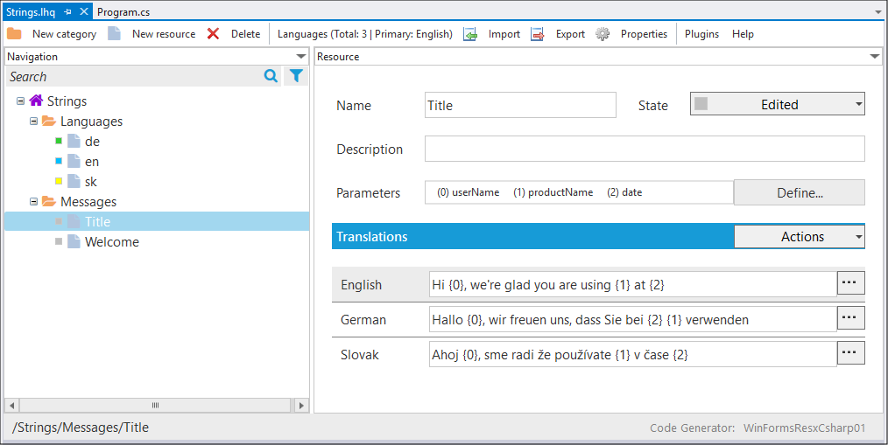
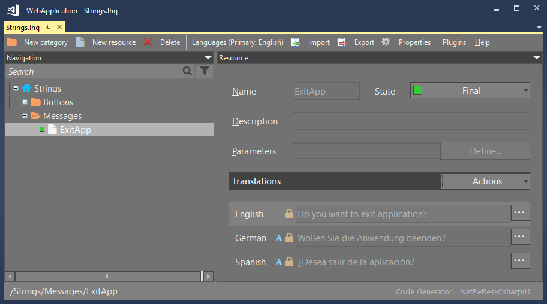

# Localization HQ Editor (aka lhqeditor)
**Visual Studio (2015/2017/2019/2022)** editor extension for one-stop localizations, resources, strings, importing multiple resx strings into one centralized file. Generate C# source files with strong-typed classes to be consumed by .NET application.

> Official project page on: [psulek.github.io/lhqeditor](https://psulek.github.io/lhqeditor/)

## Features

### WYSIWYG Editor
- Edit and manage string resources in visual tree
- Add foreign languages using lookup editor
- Translate multiple string resources in one click
- Lock translations for editing
- Perform actions on multiple resources

### Dark Mode
- Popular Dark mode is available

### Plugins
- Buildin plugins (import, export, online translation services)
- Import resources from multiple languages resx files
- Export resources to Microsoft Excel for external translation
- Import Microsoft Excel translations from external entity

### Code Generator
- Save file automatically generates code (strongly typed C#, resX, JSON)
- Different generator for ASP.NET Core, WPF, WinForms

### Visual Studio Templates
- New Project Wizard ➞ Localization HQ ➞ Project Templates
- New Item Wizard ➞ Localization HQ ➞ Item Templates

### Nuget Packages
- Nuget package for [ASP.NET Core](https://www.nuget.org/packages/ScaleHQ.AspNetCore.LHQ/)
- Nuget package for [WPF](https://www.nuget.org/packages/ScaleHQ.WPF.LHQ/)

> Read more about features and help pages on: [psulek.github.io/lhqeditor](https://psulek.github.io/lhqeditor/)

## Installation
There are two versions of **lhqeditor** extension:
- **LHQ Editor** for Visual Studio 2015 / 2017 / 2019
- **LHQ Editor VS2022** for Visual Studio 2022

Install **lhqeditor** extension from [Visual Studio Marketplace](https://marketplace.visualstudio.com):
- [LHQ Editor](https://marketplace.visualstudio.com/items?itemName=scalehqsolutions.lhqeditor)
- [LHQ Editor VS2022](https://marketplace.visualstudio.com/items?itemName=scalehqsolutions.lhqeditorvs2022)

-or-

Install **lhqeditor** extension directly from Visual Studio IDE:
- Main Menu ➞ Extensions ➞ Manage Extensions ➞ Online ➞ enter search term "lhq"

## Contributors
Wanna help with project? 

To fix a bug or add new feature, follow these steps:

- Fork the repo
- Create a new branch `git checkout -b bugfix`
- Make the appropriate changes
- Commit your changes `git commit -am 'Bug fixed'
- Push to the branch `git push origin bugfix`
- Create a Pull Request

## Bug / Feature Request
If you find a bug or missing some feature, please add new issue [here](https://github.com/psulek/lhqeditor/issues).

## Project Status
✅ Project is stable
