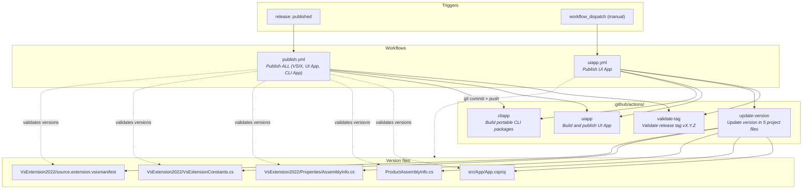

# GitHub Workflows & Actions Diagram

## Workflow Summary

| Workflow | Trigger | Custom Actions | Key Behavior |
|----------|---------|----------------|--------------|
| **publish.yml** | Release published | validate-tag, uiapp, cliapp | Validates all 5 version files match tag, builds VSIX + UI App + CLI, publishes to VS Marketplace and GitHub Releases |
| **uiapp.yml** | Manual dispatch | validate-tag, update-version, uiapp, cliapp (optional) | Updates all 5 version files, commits and pushes back to branch, builds and publishes UI App |

## Action Summary

| Action | Purpose | Key Inputs | Key Outputs |
|--------|---------|------------|-------------|
| **validate-tag** | Validates `vX.Y.Z` tag format, extracts version | `tag` | `tag_version`, `tag_valid` |
| **update-version** | Updates version in 5 project files | `new_version` | - |
| **uiapp** | Ensures release exists, installs vpk, builds/publishes UI app | `mode`, `vpk_version`, `channel` | - |
| **cliapp** | Builds portable Linux + Windows CLI packages | `new_version` | `linux_path`, `windows_path` |
